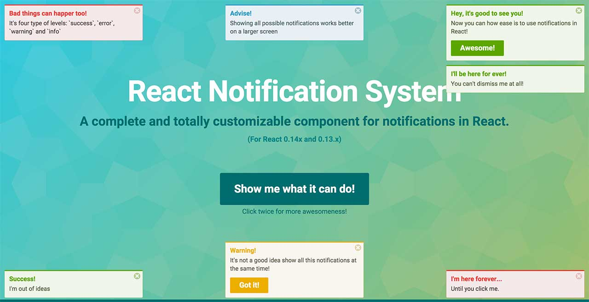

# React MobX Notification System

[](http://badge.fury.io/js/react-mobx-notification-system) [](https://www.npmjs.com/package/react-mobx-notification-system) [](https://david-dm.org/robksawyer/react-mobx-notification-system) [](https://david-dm.org/robksawyer/react-mobx-notification-system#info=devDependencies) [](https://travis-ci.org/robksawyer/react-mobx-notification-system) [](https://coveralls.io/github/robksawyer/react-mobx-notification-system?branch=master)

> A complete and totally customizable component for notifications in React and MobX.

This project was mostly based on the work of [igorprado/react-notification-system](https://github.com/igorprado/react-notification-system). I implemented [react-move](https://github.com/react-tools/react-move) for transitions, removed React component `refs` in preference of [MobX stores](https://mobx.js.org/best/store.html), and made it work with [React 16](https://reactjs.org/blog/2017/09/26/react-v16.0.html). Enjoy!

<a href="https://robksawyer.github.io/react-mobx-notification-system/"></a>

## Installing

This component is available as CommonJS and UMD module. Install via yarn running:

```
yarn add react-mobx-notification-system
```

## Using

For optimal appearance, this component **must be rendered on a top level HTML element** in your application to avoid position conflicts.

Here is a basic example. For a more advanced usage, please see the [example code](https://github.com/robksawyer/react-mobx-notification-system/blob/master/example/src/scripts/App.jsx).

```js
import React from 'react';
import ReactDOM from 'react-dom';
import NotificationSystem from 'react-mobx-notification-system'

class MyRootApp extends Component {
  render() {
    return (
      <div>
        ...
        <NotificationSystem/>
      </div>
    )
  }
}
```

Add a reference to the `NotificationStore` to your global store.

```js
/**
 * stores.js
 * Handles bringing all of the states together into a single callable method.
 *
 * Dependencies
 *
 * rfx-core: Collection of core functionalities of RFX Stack.
 * @see https://github.com/foxhound87/rfx-core
 *
 * RFX Stack?
 * @see https://github.com/foxhound87/rfx-stack/blob/master/DOCUMENTATION.md
 *
 */
import { store } from 'rfx-core';

import AppStore from './AppStore';
import NotificationStore from '../components/NotificationSystem/NotificationStore';

export default store.setup({
  appStore: AppStore,
  notificationStore: NotificationStore,
});

```

Build a notification.

```js
notificationStore.addNotification({
  message: 'Test',
  level: 'warning'
});
```

## Methods

### `addNotification(notification)`

Add a notification object. This displays the notification based on the [object](#creating-a-notification) you passed.

Returns the notification object to be used to programmatically dismiss a notification.

### `removeNotification(notification)`

Remove a notification programmatically. You can pass an object returned by `addNotification()` or by `onAdd()` callback. If passing an object, you need to make sure it must contain the `uid` property. You can pass only the `uid` too: `removeNotification(uid)`.


### `editNotification(notification)`

Edit a notification programmatically. You can pass an object previously returned by `addNotification()` or by `onAdd()` callback. If passing an object, you need to make sure it must contain the `uid` property. You can pass only the `uid` too: `editNotification(uid)`.


### `clearNotifications()`

Removes ALL notifications programatically.

## Creating a notification

The notification object has the following properties:

| Name         | Type            | Default   | Description                                                                                                                                                               |
|------------  |---------------  |---------  |-------------------------------------------------------------------------------------------------------------------------------------------------------------------------  |
| title        | string          | null      | Title of the notification                                                                                                                                                 |
| message      | string          | null      | Message of the notification                                                                                                                                              |
| level        | string          | null      | Level of the notification. Available: **success**, **error**, **warning** and **info**                                                                                    |
| position     | string          | tr        | Position of the notification. Available: **tr (top right)**, **tl (top left)**, **tc (top center)**, **br (bottom right)**, **bl (bottom left)**, **bc (bottom center)**  |
| autoDismiss  | integer         | 5         | Delay in seconds for the notification go away. Set this to **0** to not auto-dismiss the notification                                                                      |
| dismissible  | bool            | true      | Set if notification is dismissible by the user. [See more](#dismissible)                                                                                                  |
| action       | object          | null      | Add a button with label and callback function (callback is optional). [See more](#action)                                                                                                        |
| children       | element,string          | null      | Adds custom content, and overrides `action` (if defined) [See more](#children)                                                                                                        |
| onAdd | function | null | A callback function that will be called when the notification is successfully added. The first argument is the original notification e.g. `function (notification) { console.log(notification.title + 'was added'); }` |
| onRemove     | function        | null      | A callback function that will be called when the notification is about to be removed. The first argument is the original notification e.g. `function (notification) { console.log(notification.title + 'was removed'); }` |
| uid          | integer/string           | null      | Overrides the internal `uid`. Useful if you are managing your notifications id. Notifications with same `uid` won't be displayed. |


### Dismissible

If set to false, the notification will not display the dismiss ('x') button and will only be dismissible programmatically or after autoDismiss timeout. [See more](#removenotificationnotification)

### Action

Add a button and a callback function to the notification. If this button is clicked, the callback function is called (if provided) and the notification is dismissed.

```js
notification = {
  [...],
  action: {
    label: 'Button name',
    callback: function() {
      console.log('Notification button clicked!');
    }
  }
}

```

### Children

Add custom content / react elements

```js
notification = {
  [...],
  children: (
    <div>
      <h2>Hello World</h2>
      <a>Anchor</a>
    </div>
  )
}

```

## Styles

This component was made to work as plug and play. For that, a handcrafted style was added to it and is used as inline CSS.

You can change this style by overriding the default inline styles or disable all inline styles and use your own styles.

### Overriding

For this, use the `style` prop to pass an object with your styles. Your object must be something like this:

```js
var style = {
  NotificationItem: { // Override the notification item
    DefaultStyle: { // Applied to every notification, regardless of the notification level
      margin: '10px 5px 2px 1px'
    },

    success: { // Applied only to the success notification item
      color: 'red'
    }
  }
}

<NotificationSystem style={style} />

```

Refer to [this file](https://github.com/robksawyer/react-mobx-notification-system/blob/master/src/styles.js) to see what can you override.

### Disabling inline styles

To disable all inline styles, just pass `false` to the prop `style`.

```js
<NotificationSystem style={false} />
```

Here is the notification HTML:

```html
<div class="notifications-wrapper">
  <div class="notifications-{position}"> <!-- '{position}' can be one of the positions available: ex: notifications-tr -->
    <div class="notification notification-{level} notification-{state} {notification-not-dismissible}"> <!-- '{level}' can be: success | error | warning | info. '{state}' can be: visible | hidden. {notification-not-dismissible} is present if notification is not dismissible by user -->
      <h4 class="notification-title">Default title</h4>
      <div class="notification-message">Default message</div>
      <span class="notification-dismiss">×</span>
      <div class="notification-action-wrapper">
        <button class="notification-action-button">Action button</button>
      </div>
    </div>
  </div>
</div>

```


## Roadmap

* Improve tests and coverage
* Improve performance

## Contributions

Clone this repo by running:

```
git clone git@github.com:robksawyer/react-mobx-notification-system.git
```

Enter the project folder and install the dependencies:

```
yarn
```

To start a development server and use the `example` app to load the component, type:

```
yarn start
```

Open `http://localhost:8000`.

---

Run the tests:

```
yarn test
```

You can find the coverage details under `coverage/` folder.

After that, just edit the files under `src/` and `example/src/app.js`. It uses React hot reload.

This component is under construction. I will add more guidelines to who wants to contribute.
